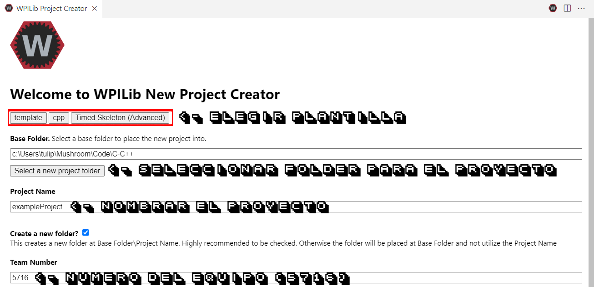

Codigos previos del equipo
==========================

Introducción
------------

Durante la existencia del equipo Keybot 5716, desde su fundación en
2015, se han usado diferentes codigos adaptados para el robot de la
temporada y los mecanismos desarrollados para este mismo. Cabe destacar
que a partir del *Guadalajara Off-Season (2022)* el codigo de robot paso
de **Python a C++**, por lo que tanto el robot **Solaris** como el robot
**Marte** fueron programados en C++.

Codigo Base
-----------

Los robots funcionan gracias al framework conocido como **Timed Skeleton
(Advanced)** que provee WPI en la libreria WPILib, este se consigue
gracias al Creador de proyectos incluido en la extensión de de WPILib y
la “Command Palette” incluida en este. En la imagen de abajo podemos ver
un ejemplo este menu.

   Project Creator

Esta configuración genera dos archivos **Robot.cpp** y **Robot.h**,
antes de mostrar el contenido de la plantilla base es importante saber
que significa cada una de las extensiones de los archivos.

-  **“.cpp”**: Es un archivo que contienen código fuente escrito en el
   lenguaje de programación orientado a objetos C++.
-  **“.h”**: Los archivos *.h*, presentes en los lenguajes de
   programación C y C++,son llamados como los ‘archivos de cabecera’ por
   los programadores. Pueden consistir en definiciones de *variables
   externas*, *prototipos de funciones* y *constantes*.

Ya aclarado esto, el codigo por defecto para la plantilla **Timed
Skeleton (Advanced)** es el siguiente:

**Robot.cpp**

.. code:: cpp

   // Copyright (c) FIRST and other WPILib contributors.
   // Open Source Software; you can modify and/or share it under the terms of
   // the WPILib BSD license file in the root directory of this project.

   #include "Robot.h"

   void Robot::RobotInit() {}
   void Robot::RobotPeriodic() {}

   void Robot::AutonomousInit() {}
   void Robot::AutonomousPeriodic() {}

   void Robot::TeleopInit() {}
   void Robot::TeleopPeriodic() {}

   void Robot::DisabledInit() {}
   void Robot::DisabledPeriodic() {}

   void Robot::TestInit() {}
   void Robot::TestPeriodic() {}

   void Robot::SimulationInit() {}
   void Robot::SimulationPeriodic() {}

   #ifndef RUNNING_FRC_TESTS
   int main() {
     return frc::StartRobot<Robot>();
   }
   #endif

**Robot.h**

.. code:: cpp

   // Copyright (c) FIRST and other WPILib contributors.
   // Open Source Software; you can modify and/or share it under the terms of
   // the WPILib BSD license file in the root directory of this project.

   #pragma once

   #include <frc/TimedRobot.h>

   class Robot : public frc::TimedRobot {
    public:
     void RobotInit() override;
     void RobotPeriodic() override;

     void AutonomousInit() override;
     void AutonomousPeriodic() override;

     void TeleopInit() override;
     void TeleopPeriodic() override;

     void DisabledInit() override;
     void DisabledPeriodic() override;

     void TestInit() override;
     void TestPeriodic() override;

     void SimulationInit() override;
     void SimulationPeriodic() override;
   };

Camera Matricies (Advanced Users)
-----------------------------------

.. tabs::

	.. tab:: Limelight 2 960x720

		.. code-block:: c++

			cameraMatrix = cv::Matx33d(
						772.53876202, 0., 479.132337442,
						0., 769.052151477, 359.143001808,
						0., 0., 1.0);
			distortionCoefficient =  std::vector<double> {
						2.9684613693070039e-01, -1.4380252254747885e+00,-2.2098421479494509e-03,
						-3.3894563533907176e-03, 2.5344430354806740e+00};

			focalLength = 2.9272781257541; //mm
			
	.. tab:: Limelight 1 960x720

		.. code-block:: c++

			cameraMatrix = cv::Matx33d(
					8.8106888208290547e+02, 0., 4.8844767170376019e+02,
					0., 8.7832357838726318e+02, 3.5819038625928994e+02,
					0., 0., 1.);
			distortionCoefficient =  std::vector<double> {
					1.3861168261860063e-01, -5.4784067711324946e-01,
					-2.2878279907387667e-03, -3.8260257487769065e-04,
					5.0520158005588123e-01 };
			
			focalLength = 3.3385168390258093; //mm
